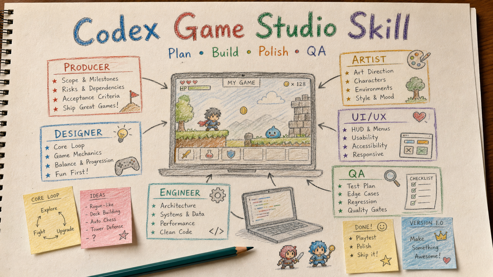

# Codex Game Studio Skill

[中文](README.md) | **English**



A Codex skill for game-development work using a compact multi-discipline studio workflow.

This skill helps Codex reason like a small game team when planning, building, testing, and polishing game projects. It is especially useful for Godot, Unity, Phaser, WebGL, 2D prototypes, gameplay systems, UI/HUD work, QA, game feel, and phase planning.

## What It Does

When activated, the skill asks Codex to approach game work through roles such as:

- Producer: scope, milestones, risk, acceptance criteria
- Sr Game Designer: core loop, design pillars, player experience
- Mid Game Designer: feature specs, tuning, content, user stories
- Mechanics Engineer: architecture, gameplay systems, engine integration
- Game Feel Engineer: responsiveness, feedback, polish, performance
- Sr Game Artist: art direction, visual style, asset needs
- Technical Artist: shaders, particles, lighting, optimization
- UI/UX Designer: HUD, menus, accessibility, responsive layout
- QA: test plans, edge cases, regression risks, release readiness
- Market Analyst: genre expectations, competitors, audience fit
- Data Scientist: metrics, telemetry, balancing signals

It does not run multiple background agents. It gives Codex a disciplined workflow for choosing the right perspectives before acting.

## Long Project Handoff

For long-running game projects, this skill can maintain a project-local `CODEX_HANDOFF.md` so Codex can continue after context compression or a later session.

Recommended project instruction:

```text
Keep developing this game project across phases.
Update CODEX_HANDOFF.md after each substantial task.
End every substantial response with:

【交接狀態】
- CODEX_HANDOFF.md 是否已更新：
- 本次修改檔案：
- 測試結果：
- 目前風險：
- 下一個最安全任務：
```

This is especially useful for Godot projects with many phases, scene/script changes, smoke tests, and QA passes.

## Install

Copy this folder into your Codex skills directory:

```powershell
Copy-Item -Recurse -Force . "$env:USERPROFILE\.codex\skills\gamestudio"
```

Restart Codex after installing.

## Usage

```text
$gamestudio Help me plan the next phase of my Godot game.
```

```text
$gamestudio Review this BattlePage feature from producer, designer, engineer, and QA perspectives.
```

```text
$gamestudio Implement the next playable prototype slice, then define QA checks.
```

## Repository Layout

```text
SKILL.md
references/
  godot.md
  roles.md
  templates.md
  workflows.md
```

## Attribution

This Codex skill is inspired by and adapted from:

https://github.com/pamirtuna/gamestudio-subagents

The original project is licensed under the MIT License. See `NOTICE.md` for attribution details.

## License

MIT License. See `LICENSE`.
