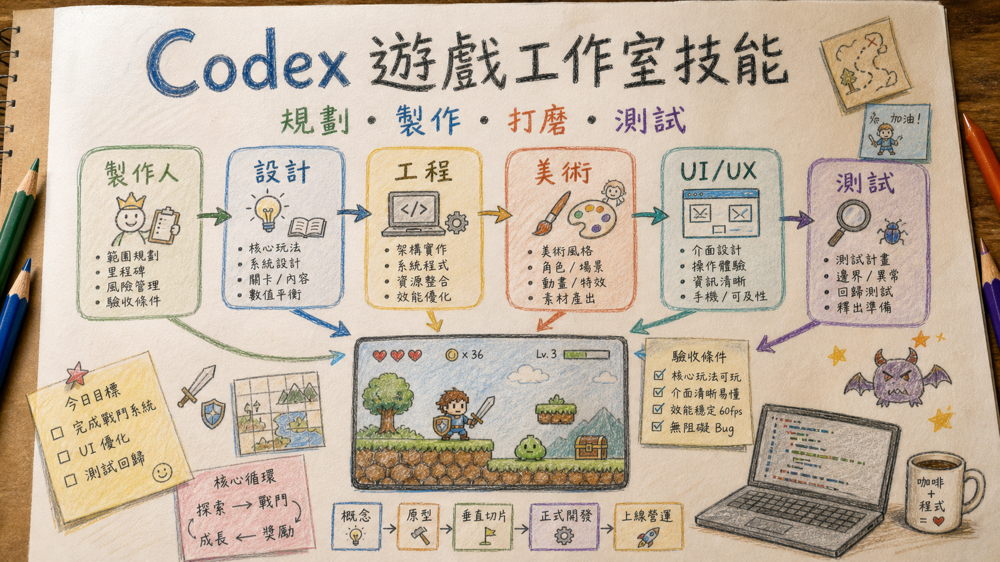

# Codex 遊戲工作室技能

**中文** | [English](README.en.md)



一個給 Codex 使用的遊戲開發 skill，讓 Codex 在規劃、製作、測試、打磨遊戲時，用「小型遊戲工作室」的方式思考。

它特別適合 Godot、Unity、Phaser、WebGL、2D 原型、玩法系統、UI/HUD、QA、遊戲手感與 Phase 規劃。

新版整合了長專案工作規則：盡量在同一個對話完成目標、採用最小可行修改、每個重要階段維護 `CODEX_HANDOFF.md`，同一個錯誤多次修不好時先建立 `DEBUG_HANDOFF.md` 釐清根因。

## 它能做什麼

啟用後，這個 skill 會讓 Codex 用多個遊戲開發角色一起判斷問題：

- 製作人：範圍、里程碑、風險、驗收標準
- 資深遊戲設計：核心循環、設計支柱、玩家體驗
- 遊戲設計：功能規格、數值調整、內容、玩家故事
- 玩法工程：架構、遊戲系統、引擎整合
- 遊戲手感工程：回饋、節奏、打磨、效能
- 美術指導：視覺方向、風格、資產需求
- 技術美術：Shader、粒子、燈光、最佳化
- UI/UX：HUD、選單、可及性、響應式版面
- QA：測試計畫、邊界案例、回歸風險、發布檢查
- 市場分析：類型期待、競品、受眾定位
- 數據分析：指標、遙測、平衡依據

它不會真的在背景啟動多個 agent。它的用途是讓 Codex 在行動前，用更完整的遊戲開發流程選擇正確視角。

另外它也加入了遊戲素材路由規則：

- 角色、怪物、道具、投射物、特效、動畫表走 sprite 工作流
- 地圖、關卡、戰鬥背景、tilemap、parallax、碰撞區走 map 工作流
- 需要透明去背或 chroma key 的產圖，優先用純綠 `#00FF00` 背景；綠色會干擾主體或去背失敗時，才改用洋紅 `#FF00FF`

## 長專案交接

對於需要跨很多回合、很多 Phase、甚至經過上下文壓縮的長期遊戲專案，這個 skill 會建議維護專案根目錄的 `CODEX_HANDOFF.md`。

推薦專案規則：

```text
持續開發這個遊戲專案。
每次完成重要任務後更新 CODEX_HANDOFF.md。
每次重要回覆最後附上：

【交接狀態】
- CODEX_HANDOFF.md 是否已更新：
- 本次修改檔案：
- 測試結果：
- 目前風險：
- 下一個最安全任務：
```

這對 Godot 專案很有用，尤其是有很多 Phase、場景、腳本、smoke test 和 QA 檢查時。

## 重複錯誤排查

如果同一個錯誤修了好幾次還沒有解決，這個 skill 會要求 Codex 暫停繼續亂改，先建立或更新 `DEBUG_HANDOFF.md`，記錄錯誤現象、重現步驟、已嘗試修法、失敗原因、根因假設與下一個驗證步驟。

## 安裝

將這個資料夾複製到你的 Codex skills 目錄：

```powershell
Copy-Item -Recurse -Force . "$env:USERPROFILE\.codex\skills\gamestudio"
```

安裝後請重開 Codex。

## 使用方式

```text
$gamestudio 幫我規劃 Godot 遊戲的下一個 Phase。
```

```text
$gamestudio 用製作人、設計、工程、QA 的角度 review 這個 BattlePage 功能。
```

```text
$gamestudio 實作下一個可玩的原型切片，並定義 QA 檢查。
```

## 專案結構

```text
SKILL.md
references/
  asset-routing.md
  godot.md
  handoff-debug.md
  minimal-workflow.md
  roles.md
  source-boundary.md
  templates.md
  workflows.md
```

## 來源與致謝

這個 Codex skill 主要受到以下專案啟發並改寫：

- https://github.com/pamirtuna/gamestudio-subagents

另外也參考並整合了以下開源 skill 的工作流概念：

- https://github.com/DietrichGebert/ponytail
- https://github.com/0x0funky/agent-sprite-forge

本 repo 沒有打包或執行上述專案的完整 runtime、scripts 或 assets；只是把遊戲工作室、最小可行修改、sprite/map 素材路由等規則整理成 Codex 可用的 `gamestudio` skill。詳細來源標示請見 `NOTICE.md`。

## 授權

MIT License。請見 `LICENSE`。
